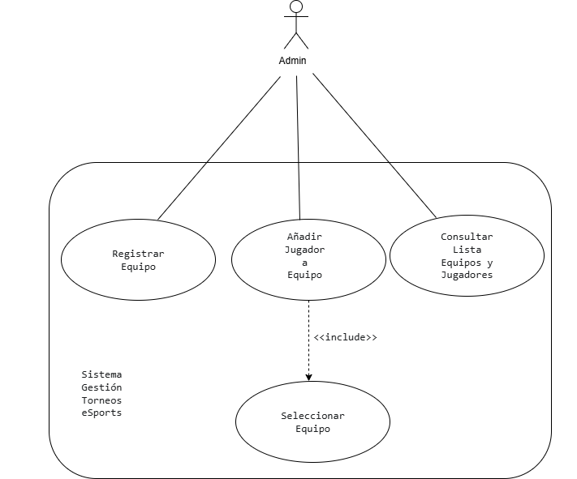
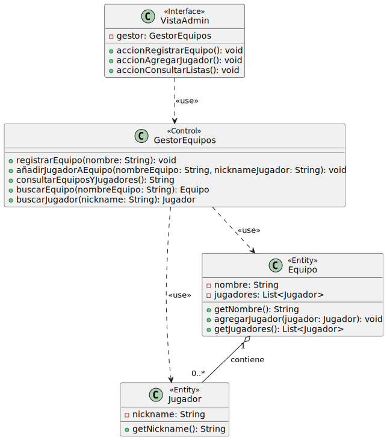
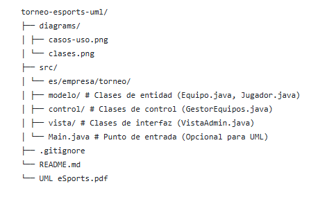

# Sistema de Gestión de Torneos de eSports

## Autor

*   **Nombre:** [José Carlos]
*   **Perfil GitHub:** [https://github.com/JCFerreiro/]

## Descripción del Proyecto

*   **Repositorio:** [https://github.com/JCFerreiro/AD-3-Diagramas-UML]

El proyecto implementa un sistema de gestión de torneos de eSports utilizando UML para el modelado y Java para la implementación.
En esta actividad (AD-3), nos hemos enfocado únicamente en el modelado UML para la funcionalidad de **Gestión de Equipos y Jugadores**.

## Diagramas UML

### Diagrama de Casos de Uso

Este diagrama de casos de uso muestra cómo funciona la 'Gestión de Equipos y Jugadores', destacando al Administrador como el actor principal y las interacciones clave, incluyendo la relación `<<include>>` necesaria.

### Diagrama de Clases

Este diagrama de clases está diseñado para implementar las funcionalidades, organizando las capas en Entidad, Control e Interfaz

## Estructura del Proyecto

## Instalación y Ejecución

La implementación Java es opcional en el ejerccio y no forma parte de esta entrega específica de UML

## Justificación del diseño

### Diagrama de Casos de Uso:

Elegí al Administrador como actor porque las funciones solicitadas (registrar equipos, añadir jugadores, consultar listas) son típicas de gestión y configuración que realizaría un Administrador en este tipo de sistema.

Incluimos los casos de uso Registrar Equipo, Añadir Jugador a Equipo y Consultar Lista de Equipos y Jugadores porque son las funcionalidades específicas requeridas en el enunciado del ejercicio para la 'Gestión de equipos y jugadores'. Representan las interacciones clave que necesitamos modelar.

Se añadió el caso de uso Seleccionar Equipo y se conectó mediante una relación <<include>> desde Añadir Jugador a Equipo. Esto se hizo, para añadir un jugador a un equipo, siempre es necesario primero identificar o elegir a qué equipo se va a añadir. La relación <<include>> en UML sirve precisamente para indicar esta dependencia funcional obligatoria y reutilizable.

### Diagrama de Clases:

Identifiqué las clases principales basándome en  la estructura sugerida. Equipo y Jugador son las Entidades (Entity) que almacenan la información principal. Cree GestorEquipos como la clase de Control (Control) para manejar la lógica de negocio relacionada con equipos y jugadores, actuando como intermediario. Finalmente, VistaAdmin representa la capa de Interfaz (Interface) a través de la cual el administrador interactúa con el sistema.

Opté por separar el sistema en Entidad, Control e Interfaz para seguir una arquitectura modular. Esto ayuda a organizar mejor el sistema, separando la presentación (Vista), la lógica (Control) y los datos (Entidad). Así, es más fácil realizar modificaciones y mantener el sistema en el futuro, ya que cada capa tiene una responsabilidad bien definida.

La relación entre Equipo y Jugador se modeló usando agregación (el rombo hueco). Esto significa que un Equipo 'contiene' o agrupa Jugadores. La cardinalidad 1 en Equipo y 0..* en Jugador se eligió porque un equipo debe existir para tener jugadores, pero puede ser registrado (existir como objeto) antes de tener jugadores asignados (estado de 0 jugadores), y puede tener muchos jugadores a lo largo del tiempo. Esto encaja con el flujo de registrar primero el equipo y luego añadirle jugadores.

Use relaciones de dependencia (use, la línea discontinua con flecha) para mostrar cómo interactúan las capas: VistaAdmin necesita los métodos de GestorEquipos para iniciar las acciones, y GestorEquipos, a su vez, necesita las clases Equipo y Jugador para acceder a sus datos y ejecutar la lógica (buscarlos, crearlos, modificarlos).

Es importante mencionar que este es un diseño simplificado, enfocado en cumplir los requisitos del ejercicio (AD3), sin entrar en todos los detalles que tendría un sistema real completo.

### Proceso de Diseño 

Además de los diagramas finales presentados, el proceso incluyó la elaboración de bocetos y análisis intermedios. [Documento UML eSports (PDF)](UML eSports.pdf)

## Conclusiones

Realizar esta actividad me ha permitido aprender varios aspectos importantes:

He comprendido mejor la utilidad de UML, viendo cómo los diagramas de casos de uso ayudan a definir qué debe hacer el sistema desde la visión del usuario, mientras que los diagramas de clases muestran cómo se estructura internamente para lograrlo.

Queda más clara la importancia de analizar los requisitos antes de empezar a programaar.

Aplicar los estereotipos Entity, Control e <Interface> me ha ayudado cómo organizar el software de forma más estructurada.

Reflexionar sobre las relaciones entre clases (agregación, dependencia) y sus cardinalidades me ha hecho pensar cómo interactúan los diferentes componentes del sistema.

Afrontar este ejercicio ha sido un desafío interesante. Sé que dominar esto lleva tiempo y práctica, pero este ejercicio ha sido un buen empujón, especialmente en este momento delicado de la asignatura, donde he tenido que apoyarme mucho en el autoaprendizaje para resolverlo
